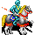
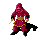

include::units.txt[]
include::artifacts.txt[]
include::runes.txt[]
include::scrolls.txt[]

:sectnums:
//:toc: macro
:toc: left
:source-highlighter: pygments
:pygments-linenums-mode: inline
:sectnumlevels: 5
:toclevels: 5
:theme: flask

= Оглавление
Team Name <ourTeam@command.com>

== Глава 1

Текст из главы 1.

=== Подраздел главы 1

NOTE: Полезно ознакомиться с документацией http://www.methods.co.nz/asciidoc/userguide.html#X30

== Войска

[IMPORTANT]
====
[role="summary"]
Это описание создано для синхронизации чисел в описании со значением в коде игры Terra Bellica 2. При запуске игра будет обращаться к настоящему описанию и считывать настройки игры.
Для этого перед текстовым описанием, экспортируемым в серверную программу, ставим англоязычные идентификаторы в двойных квадратных скобках [[identifier]]. Идентификаторы не видны в тексте, но остаются как закладка в тексте-исходнике документа.

Все характеристики подразделений записаны в виде констант в файлах

* artifacts.txt
* runes.txt
* scrolls.txt
* units.txt

которые подключаются к данному документу в его первой строке. Для вставки числовой характеристики юнита используем имя идентификатора в фигурных скобках (см таблицу про ополченцев для примера).

Все числа стараемся указывать в подключаемых файлах *.txt, здесь указываем ссылку на константу. Пример: дальняя защита пикинера равна {Pikeman_DD}
====

=== Базовые войска

Все юниты обладают индивидуальными особенностями. Универсальных войск нет. Для каких-то целей лучше подходят одни войска, для других - другие. Хороший тактик всегда будет использовать преимущества каждого войска.

==== Ополченцы
[[Volunteer_Start]]
Массовые дешевые войска. Слабые и плохо обученные, в большом количестве они могут представлять серьезную силу.
[[Volunteer_End]]
.Ополченцы

[width="40%",cols="18,^9"]
|====================
|Тип|Воины
|Атака|{Volunteer_CA}
|Дальняя атака|{Volunteer_DA}  
|Дистанция атаки|{Volunteer_DIST}
|Защита|{Volunteer_CD}
|Дальняя защита|{Volunteer_DD}
|Магическая атака|{Volunteer_MA}
|Магическая защита|{Volunteer_MD}
|Разброс атаки|{Volunteer_AV}
|Разброс защиты|{Volunteer_DV}
|HP|{Volunteer_HP} 
|Ходы|{Volunteer_AP}
|Когорта|{Volunteer_CHRT} воинов 
|Стоимость найма|Золото {Volunteer_Cost_Gold}
|Время призыва (без учёта уровня здания)|6 часов  
|Атака на горы|70%  
|====================

==== Пикинеры
[[Pikeman_Start]]
Копейщики эффективны в обороне. Они вооружены длинными пиками, позволяющими успешно действовать против кавалерии.
[[Pikeman_End]]
.Пикинеры

[width="54%",cols="18,^9"]
|====================
|Тип|Воины
|Атака|{Pikeman_CA}
|Дальняя атака|{Pikeman_DA}  
|Дистанция атаки|{Pikeman_DIST}
|Защита|{Pikeman_CD}
|Дальняя защита|{Pikeman_DD}
|Магическая атака|{Pikeman_MA}
|Магическая защита|{Pikeman_MD}
|Разброс атаки|{Pikeman_AV}
|Разброс защиты|{Pikeman_DV}
|HP|{Pikeman_HP} 
|Ходы|{Pikeman_AP}
|Когорта|{Pikeman_CHRT} воинов 
|Стоимость найма|Золото {Pikeman_Cost_Gold}
|Время призыва (без учёта уровня здания)|6 часов
|Атака против разведчиков|150%
|Атака против рыцарей|140%
|Атака против темных рыцарей|140%
|Атака на горы|70%  
|====================

==== Лучники
[[Archer_Start]]
Лёгкие стрелки. Они быстро перемещаются и способны поразить цель на большом расстоянии, но уязвимы в ближнем бою.
[[Archer_End]]
.Лучники

[width="54%",cols="18,^9"]
|====================
|Тип|Воины
|Атака|{Archer_CA}
|Дальняя атака|{Archer_DA}  
|Дистанция атаки|{Archer_DIST}
|Защита|{Archer_CD}
|Дальняя защита|{Archer_DD}
|Магическая атака|{Archer_MA}
|Магическая защита|{Archer_MD}
|Разброс атаки|{Archer_AV}
|Разброс защиты|{Archer_DV}
|HP|{Archer_HP} 
|Ходы|{Archer_AP}
|Когорта|{Archer_CHRT} воинов 
|Стоимость найма| Дерево {Archer_Cost_Wood}
|Время призыва (без учёта уровня здания)|9 часов
|Атака на лес|80%
|Атака на горы|70%  
|====================

==== Арбалетчики
[[Arbalester_Start]]
Менее подвижные, чем лучники стрелки. Арбалет представляет собой фактически лук, дополненный ложем и спусковым механизмом. Более тяжёлые стрелы (именуемые болтами) позволяют пробивать более крепкий доспех. Стреляют с небольших расстояний. 
[[Arbalester_End]]
.Арбалетчики

[width="54%",cols="18,^9"]
|====================
|Тип|Воины
|Атака|{Arbalester_CA}
|Дальняя атака|{Arbalester_DA}  
|Дистанция атаки|{Arbalester_DIST}
|Защита|{Arbalester_CD}
|Дальняя защита|{Arbalester_DD}
|Магическая атака|{Arbalester_MA}
|Магическая защита|{Arbalester_MD}
|Разброс атаки|{Arbalester_AV}
|Разброс защиты|{Arbalester_DV}
|HP|{Arbalester_HP} 
|Ходы|{Arbalester_AP}
|Когорта|{Arbalester_CHRT} воинов 
|Стоимость найма|Золото {Arbalester_Cost_Gold}, металл {Arbalester_Cost_Metal}
|Время призыва (без учёта уровня здания)|9 часов
|Атака против арбалетчиков|120%
|Атака против кнехтов|150%
|Атака против рыцарей|135%
|Атака против огров|135%
|Атака против темных рыцарей|135%
|Атака на лес|80%
|Атака на горы|70%  
|====================

==== Мечники
[[Swordsman_Start]]
Мастера ближнего боя. Эффективны в любой местности. Особенно хороши против пехоты, но их мечи не всегда способны дотянуться до кавалеристов.
[[Swordsman_End]]
.Мечники

[width="54%",cols="18,^9"]
|====================
|Тип|Воины
|Атака|{Swordsman_CA}
|Дальняя атака|{Swordsman_DA}  
|Дистанция атаки|{Swordsman_DIST}
|Защита|{Swordsman_CD}
|Дальняя защита|{Swordsman_DD}
|Магическая атака|{Swordsman_MA}
|Магическая защита|{Swordsman_MD}
|Разброс атаки|{Swordsman_AV}
|Разброс защиты|{Swordsman_DV}
|HP|{Swordsman_HP} 
|Ходы|{Swordsman_AP}
|Когорта|{Swordsman_CHRT} воинов 
|Стоимость найма| Золото {Swordsman_Cost_Gold}
|Время призыва (без учёта уровня здания)|12 часов
|Атака против разведчиков|70%
|Атака против рыцарей|70%
|Атака против темных рыцарей|70%
|====================

==== Кнехты
[[Kneht_Start]]
Тяжело бронированная пехота. Достаточно малоподвижна и неповоротлива, сражается медленно, но верно.
[[Kneht_End]]
.Кнехты

[width="54%",cols="18,^9"]
|====================
|Тип|Воины
|Атака|{Kneht_CA}
|Дальняя атака|{Kneht_DA}  
|Дистанция атаки|{Kneht_DIST}
|Защита|{Kneht_CD}
|Дальняя защита|{Kneht_DD}
|Магическая атака|{Kneht_MA}
|Магическая защита|{Kneht_MD}
|Разброс атаки|{Kneht_AV}
|Разброс защиты|{Kneht_DV}
|HP|{Kneht_HP} 
|Ходы|{Kneht_AP}
|Когорта|{Kneht_CHRT} воинов 
|Стоимость найма|Золото {Kneht_Cost_Gold}, металл {Kneht_Cost_Metal}
|Время призыва (без учёта уровня здания)|12 часов
|Атака на горы|70%
|====================

==== Разведчики
[[Cavalry_Start]]
Лёгкая кавалерия. Способна предпринимать быстрые дальние рейды на позиции врага.
[[Cavalry_End]]
.Разведчики

[width="54%",cols="18,^9"]
|====================
|Тип|Воины
|Атака|{Cavalry_CA}
|Дальняя атака|{Cavalry_DA}  
|Дистанция атаки|{Cavalry_DIST}
|Защита|{Cavalry_CD}
|Дальняя защита|{Cavalry_DD}
|Магическая атака|{Cavalry_MA}
|Магическая защита|{Cavalry_MD}
|Разброс атаки|{Cavalry_AV}
|Разброс защиты|{Cavalry_DV}
|HP|{Cavalry_HP} 
|Ходы|{Cavalry_AP}
|Когорта|{Cavalry_CHRT} воинов 
|Стоимость найма|Золото {Cavalry_Cost_Gold}, дерево {Cavalry_Cost_Wood}
|Время призыва (без учёта уровня здания)|18 часов
|Атака на лес|50%
|Атака на горы|50%
|====================

==== Рыцари
[[Knight_Start]]
Тяжело вооруженные рыцари - самая мощная атакующая сила в поле. Хороши против пехоты. Эффективны только на равнине.
[[Knight_End]]
.Рыцари

[width="54%",cols="18,^9"]
|====================
|Тип|Воины
|Атака|{Knight_CA}
|Дальняя атака|{Knight_DA}  
|Дистанция атаки|{Knight_DIST}
|Защита|{Knight_CD}
|Дальняя защита|{Knight_DD}
|Магическая атака|{Knight_MA}
|Магическая защита|{Knight_MD}
|Разброс атаки|{Knight_AV}
|Разброс защиты|{Knight_DV}
|HP|{Knight_HP} 
|Ходы|{Knight_AP}
|Когорта|{Knight_CHRT} воинов 
|Стоимость найма|Золото {Knight_Cost_Gold}, дерево {Knight_Cost_Wood} {Knight_Cost_Metal} металл
|Время призыва (без учёта уровня здания)|18 часов
|Атака на лес|50%ы
|Атака на горы|50%
|====================

==== Маги
[[Mage_Start]]
Атакуют врагов магическими стрелами на небольшом расстоянии. Способны кастовать заклинания, используя соответствующие свитки. В рукопашной схватке слабы и поэтому нуждаются в прикрытии другими войсками.
[[Mage_End]]
.Маги

[width="54%",cols="18,^9"]
|====================
|Тип|Воины
|Атака|{Mage_CA}
|Дальняя атака|{Mage_DA}  
|Дистанция атаки|{Mage_DIST}
|Защита|{Mage_CD}
|Дальняя защита|{Mage_DD}
|Магическая атака|{Mage_MA}
|Магическая защита|{Mage_MD}
|Разброс атаки|{Mage_AV}
|Разброс защиты|{Mage_DV}
|HP|{Mage_HP} 
|Ходы|{Mage_AP}
|Когорта|{Mage_CHRT} воинов 
|Стоимость найма|Мандрагора {Mage_Cost_Mandragora} 
|Время призыва (без учёта уровня здания)|15 часов
|====================

=== Монстры

==== Орк
[[Orc_Start]]
Ходят слухи, что часть орков - это бывшие мультоводы, читеры и прочие грешники, которых Кресп подверг принудительной мутации и направил в свою армию в качестве пушечного мяса.
[[Orc_End]]
.Орки

[width="54%",cols="18,^9"]
|====================
|Тип|Воины
|Атака|{Orc_CA}
|Дальняя атака|{Orc_DA}  
|Дистанция атаки|{Orc_DIST}
|Защита|{Orc_CD}
|Дальняя защита|{Orc_DD}
|Магическая атака|{Orc_MA}
|Магическая защита|{Orc_MD}
|HP|{Orc_HP} 
|Ходы|{Orc_AP}
|Когорта|{Orc_CHRT} воинов 
|Стоимость найма|
|Атака на горы|70%
|====================

==== Орк-лучник
[[OrcArcher_Start]]
Орки-лучники
[[OrcArcher_End]]
.Орки-лучники

[width="54%",cols="18,^9"]
|====================
|Тип|Воины
|Атака|{OrcArcher_CA}
|Дальняя атака|{OrcArcher_DA}  
|Дистанция атаки|{OrcArcher_DIST}
|Защита|{OrcArcher_CD}
|Дальняя защита|{OrcArcher_DD}
|Магическая атака|{OrcArcher_MA}
|Магическая защита|{OrcArcher_MD}
|Разброс атаки|{OrcArcher_AV}
|Разброс защиты|{OrcArcher_DV}
|HP|{OrcArcher_HP} 
|Ходы|{OrcArcher_AP}
|Когорта|{OrcArcher_CHRT} воинов 
|Стоимость найма|
|Атака на лес|80%
|Атака на горы|70%
|====================

==== Элитный орк
[[OrcElite_Start]]
Элитные орки
[[OrcElite_End]]
.Элитные орки

[width="54%",cols="18,^9"]
|====================
|Тип|Воины
|Атака|{OrcElite_CA}
|Дальняя атака|{OrcElite_DA}  
|Дистанция атаки|{OrcElite_DIST}
|Защита|{OrcElite_CD}
|Дальняя защита|{OrcElite_DD}
|Магическая атака|{OrcElite_MA}
|Магическая защита|{OrcElite_MD}
|Разброс атаки|{OrcElite_AV}
|Разброс защиты|{OrcElite_DV}
|HP|{OrcElite_HP} 
|Ходы|{OrcElite_AP}
|Когорта|{OrcElite_CHRT} воинов 
|Стоимость найма|
|Атака против рыцарей|80%
|====================

==== Орк-шаман
[[OrcShaman_Start]]
Атакуют врагов магическими стрелами на небольшом расстоянии. Способны кастовать заклинания, используя соответствующие свитки. В рукопашной схватке слабы и поэтому нуждаются в прикрытии другими войсками.
[[OrcShaman_End]]
.Орк-шаман
image::description/140.gif[]

[width="54%",cols="18,^9"]
|====================
|Тип|Воины
|Атака|{OrcShaman_CA}
|Дальняя атака|{OrcShaman_DA}  
|Дистанция атаки|{OrcShaman_DIST}
|Защита|{OrcShaman_CD}
|Дальняя защита|{OrcShaman_DD}
|Магическая атака|{OrcShaman_MA}
|Магическая защита|{OrcShaman_MD}
|Разброс атаки|{OrcShaman_AV}
|Разброс защиты|{OrcShamanr_DV}
|HP|{OrcShaman_HP} 
|Ходы|{OrcShaman_AP}
|Когорта|{OrcShaman_CHRT} воинов 
|Стоимость найма|
|====================

==== Орк-пращник
[[Slinger_Start]]
Вкладывая камень или металлический шарик в ремень, эти орки метают его на значительные расстояния. Выстрелы из пращи не отличаются высокой точностью и имеют большой разброс по урону.
[[Slinger_End]]
.Орк-пращник

[width="54%",cols="18,^9"]
|====================
|Тип|Воины
|Атака|{OrcSlinger_CA}
|Дальняя атака|{OrcSlinger_DA}  
|Дистанция атаки|{OrcSlinger_DIST}
|Защита|{OrcSlinger_CD}
|Дальняя защита|{OrcSlinger_DD}
|Магическая атака|{OrcSlinger_MA}
|Магическая защита|{OrcSlinger_MD}
|Разброс атаки|{OrcSlinger_AV}
|Разброс защиты|{OrcSlinger_DV}
|HP|{OrcSlinger_HP} 
|Ходы|{OrcSlinger_AP}
|Когорта|{OrcSlinger_CHRT} воинов 
|Стоимость найма|
|Атака на лес|80%
|Атака на горы|70%
|====================

[IMPORTANT]
====
Нужно определиться с наименованием констант по орку-пращику. Slinger или OrcSlinger!!!
В игре стоимость найма - 1 камень..?
====

==== Орк-метатель топоров
[[Axer_Start]]
Метательные топоры наносят серьёзные повреждения на короткой дистанции.
[[Axer_End]]
.Метатель топоров

[width="54%",cols="18,^9"]
|====================
|Тип|Воины
|Атака|{OrcAxer_CA}
|Дальняя атака|{OrcAxer_DA}  
|Дистанция атаки|{OrcAxer_DIST}
|Защита|{OrcAxer_CD}
|Дальняя защита|{OrcAxer_DD}
|Магическая атака|{OrcAxer_MA}
|Магическая защита|{OrcAxer_MD}
|Разброс атаки|{OrcAxer_AV}
|Разброс защиты|{OrcAxer_DV}
|HP|{OrcAxer_HP} 
|Ходы|{OrcAxer_AP}
|Когорта|{OrcAxer_CHRT} воинов 
|Стоимость найма|
|Атака против арбалетчиков|120%
|Атака против кнехтов|150%
|Атака против рыцарей|135%
|Атака на лес|80%
|Атака на горы|70%
|====================

[IMPORTANT]
====
Нужно определиться с наименованием констант по орку-метателю топоров. Axer или OrcAxer!!!
В игре стоимость найма - 1 монета и 1 металл..?
====

==== Огр
[[Ogre_Start]]
Огры - толстокожие и медлительные существа. Они не любят далеко ходить, но свои владения будут защищать очень стойко.
[[Ogre_End]]
.Огры

[width="54%",cols="18,^9"]
|====================
|Тип|Воины
|Атака|{OrcOgre_CA}
|Дальняя атака|{OrcOgre_DA}  
|Дистанция атаки|{OrcOgre_DIST}
|Защита|{OrcOgre_CD}
|Дальняя защита|{OrcOgre_DD}
|Магическая атака|{OrcOgre_MA}
|Магическая защита|{OrcOgre_MD}
|Разброс атаки|{OrcOgre_AV}
|Разброс защиты|{OrcOgre_DV}
|HP|{OrcOgre_HP} 
|Ходы|{OrcOgre_AP}
|Когорта|{OrcOgre_CHRT} воинов 
|Стоимость найма|
|Атака на горы|70%
|====================

[IMPORTANT]
====
Нужно определиться с наименованием констант по огру. Ogre или OrcOgre!!!
В игре стоимость найма - 4 монеты и 1 металл..?
====

==== Темный рыцарь
[[DarkKnight_Start]]
Легендарные тёмные рыцари - смертоносная сила на равнине.
[[DarkKnight_End]]
.Темный рыцарь

[width="54%",cols="18,^9"]
|====================
|Тип|Воины
|Атака|{DarkKnight_CA}
|Дальняя атака|{DarkKnight_DA}  
|Дистанция атаки|{DarkKnight_DIST}
|Защита|{DarkKnight_CD}
|Дальняя защита|{DarkKnight_DD}
|Магическая атака|{DarkKnight_MA}
|Магическая защита|{DarkKnight_MD}
|Разброс атаки|{DarkKnight_AV}
|Разброс защиты|{DarkKnight_DV}
|HP|{DarkKnight_HP} 
|Ходы|{DarkKnight_AP}
|Когорта|{DarkKnight_CHRT} воинов 
|Стоимость найма|
|Атака на лес|60%
|Атака на горы|60%
|====================

[IMPORTANT]
====
В игре стоимость найма - 5 монет, 1 дерево и 1 металл..?
====

=== Войска религий

Каждый поклонник выбранной религии может призывать в своем храме войска своей религии, каждое войско имеет свои особенности и умения.

==== Элефанты
[[Elephant_Start]]
Большие неповоротливые существа, обладающие огромной силой в ближнем бою.
Доступны для религии силы. Большая ближняя атака и защита на равнине, много здоровья. Мало ходов. Передвижение по лесу отнимает 3 хода. Наносит сокрушительные удары, поэтому рациональнее его расстреливать с дальней дистанции.
[[Elephant_End]]
.Элефанты
image::description/150.gif[]

[width="54%",cols="18,^9"]
|====================
|Тип|Воины
|Атака|{Elephant_CA}
|Дальняя атака|{Elephant_DA}  
|Дистанция атаки|{Elephant_DIST}
|Защита|{Elephant_CD}
|Дальняя защита|{Elephant_DD}
|Магическая атака|{Elephant_MA}
|Магическая защита|{Elephant_MD}
|Разброс атаки|{Elephant_AV}
|Разброс защиты|{Elephant_DV}
|HP|{Elephant_HP} 
|Ходы|{Elephant_AP}
|Когорта|{Elephant_CHRT} воинов 
|Стоимость найма|Металл {Elephant_Cost_Metal}, мандрагора {Elephant_Cost_Mandragora}
|Атака на лес|60%
|Атака на горы|70%
|====================

==== Кочевники
[[Raider_Start]]
Конные лучники. Доступны для религии стремительности. Дистанция стрельбы - 2 клетки. Когорта небольшая, поэтому послабее лучников. Много ходов. Повышенное здоровье.
[[Raider_End]]
.Кочевники

[width="54%",cols="18,^9"]
|====================
|Тип|Воины
|Атака|{MountedArcher_CA}
|Дальняя атака|{MountedArcher_DA}  
|Дистанция атаки|{MountedArcher_DIST}
|Защита|{MountedArcher_CD}
|Дальняя защита|{MountedArcher_DD}
|Магическая атака|{MountedArcher_MA}
|Магическая защита|{MountedArcher_MD}
|Разброс атаки|{MountedArcher_AV}
|Разброс защиты|{MountedArcher_DV}
|HP|{MountedArcher_HP} 
|Ходы|{MountedArcher_AP}
|Когорта|{MountedArcher_CHRT} воинов 
|Стоимость найма|Дерево {MountedArcher_Cost_Wood}
|Атака на лес|80%
|Атака на горы|80%
|====================

[IMPORTANT]
====
Нужно определиться с наименованием констант по кочевникам. Raider или MountedArcher!!!
====

==== Джинны
[[Jinn_Start]]
Мифические существа, обладающие ближней магической атакой и атакующие всех вокруг. Доступны для религии магии. Ответ получает только от юнитов того игрока, который был на прицеле.
[[Jinn_End]]
.Джинн

[width="54%",cols="18,^9"]
|====================
|Тип|Воины
|Атака|{Jinn_CA}
|Дальняя атака|{Jinn_DA}  
|Дистанция атаки|{Jinn_DIST}
|Защита|{Jinn_CD}
|Дальняя защита|{Jinn_DD}
|Магическая атака|{Jinn_MA}
|Магическая защита|{Jinn_MD}
|Разброс атаки|{Jinn_AV}
|Разброс защиты|{Jinn_DV}
|HP|{Jinn_HP} 
|Ходы|{Jinn_AP}
|Когорта|{Jinn_CHRT} воинов 
|Стоимость найма|{Jinn_Cost_Stone} камня и {Jinn_Cost_Mandragora} мандрагоры
|Атака на горы|120%
|====================

==== Ассасин
[[Assasin_Start]]
Воин, который совмещает в себе шпиона, диверсанта и грабителя. Доступен для религии диверсий. Не блокируется при передвижении от врага к врагу. -1 видимость. Может грабить город без разрушения стен и убийства его защитников. Получает ответную атаку (не путать с автоатакой) только от юнитов, находящихся в режиме обороны. 
[[Assasin_End]]
.Ассасин

[width="54%",cols="18,^9"]
|====================
|Тип|Воины
|Атака|{Assasin_CA}
|Дальняя атака|{Assasin_DA}  
|Дистанция атаки|{Assasin_DIST}
|Защита|{Assasin_CD}
|Дальняя защита|{Assasin_DD}
|Магическая атака|{Assasin_MA}
|Магическая защита|{Assasin_MD}
|Разброс атаки|{Assasin_AV}
|Разброс защиты|{Assasin_DV}
|HP|{Assasin_HP} 
|Ходы|{Assasin_AP}
|Когорта|{Assasin_CHRT} воинов 
|Стоимость найма|Золото {Assasin_Cost_Gold}
|====================

==== Эльф
[[Elf_Start]]
Лесные воины. Доступны для религии лесов. Единственный стрелок, у которого нет штрафа при стрельбе по лесу.
[[Elf_End]]
.Эльф
image::description/190.gif[]

[width="54%",cols="18,^9"]
|====================
|Тип|Воины
|Атака|{Elf_CA}
|Дальняя атака|{Elf_DA}  
|Дистанция атаки|{Elf_DIST}
|Защита|{Elf_CD}
|Дальняя защита|{Elf_DD}
|Магическая атака|{Elf_MA}
|Магическая защита|{Elf_MD}
|Разброс атаки|{Elf_AV}
|Разброс защиты|{Elf_DV}
|HP|{Elf_HP} 
|Ходы|{Elf_AP}
|Когорта|{Elf_CHRT} воинов 
|Стоимость найма|Дерево {Elf_Cost_Wood}
|Атака на горы|70%
|====================

== Зелья

Зелья производят базовые магические заклинания, которые герой может применить к самому себе, выпив данное зелье.

=== Алхимия
Для приготовления зелий потребуется алхимический котел. Существуют несколько наборов зелий (альфа, бета..), каждый из которых имеет свои ингредиенты. Для каждого набора необходимо выбрать определенное количество ингредиентов и положить в котел. Ежедневно все котлы получают свои комбинации ингредиентов для каждого зелья, вам необходимо угадать их. В других котлах игрока могут быть другие комбинации.

Каждый котел имеет 3 хода в сутки. Если вы угадаете правильную комбинацию на первом ходе, то сможете до конца дня сварить зелье еще 2 раза, используя этот же набор ингредиентов. Если вы угадаете правильный набор на третьем ходе, то он и будет единственным результативным.

Внимание. Чем чаще какой-то ингредиент будет использоваться игроками в экспериментах по приготовлению определенного набора зелий, тем меньше шансов, что на следующий день он будет входить в его рецепты, и наоборот.

=== Виды зелий

Зелья разного типа имеют разный цвет бутылки (зеленый, красный, синий, серый).

==== Зелёные зелья

Зелёные зелья не имеют никаких особенностей, они начинают действовать на героя сразу после приёма.

.Лесной дух

Зелье позволяет видеть орков в лесу через 2 клетки.

[width="54%",cols="18,^9"]
|====================
|Тип|Альфа зелья
|Время действия|24 часа(ов)
|Время активации|Нет  
|Время деактивации|Нет
|Варится за раз|2 шт.
|====================

Зелёные зелья не имеют никаких особенностей. Они начинают действовать сразу после приёма.

.Узы смерти

Уменьшает шанс выпадения вещей из инвентаря при смерти.

[width="54%",cols="18,^9"]
|====================
|Тип|Альфа зелья
|Время действия|24 часа(ов)
|Время активации|Нет  
|Время деактивации|Нет
|Варится за раз|2 шт.
|====================

Зелёные зелья не имеют никаких особенностей. Они начинают действовать сразу после приёма.

==== Красные зелья

Чары, образованные красными зельями, спадают с героя, если он начинает атаковать или двигаться. Данные зелья в первую очередь предназначены для оффлайновой защиты.

.Зелье здоровья

Зелье увеличивает HP на 100%. Атака (в режиме обороны и ответная) уменьшается на 33%.

[width="54%",cols="18,^9"]
|====================
|Тип|Альфа зелья
|Время действия|24 часа(ов)
|Время активации|Нет  
|Время деактивации|Нет
|Варится за раз|2 шт.
|====================

Чары, образованные красными зельями, спадают с героя, если он начинает двигаться или атаковать.

.Личная защита

Полностью поглощает один ближний удар, если он не является смертельным для армии героя.

[width="54%",cols="18,^9"]
|====================
|Тип|Бета зелья
|Время действия|24 часа(ов)
|Время активации|1 минут  
|Время деактивации|Нет
|Варится за раз|4 шт.
|====================

Чары, образованные красными зельями, спадают с героя, если он начинает двигаться или атаковать.

.Зелье ловкости

Даёт герою 50% шанс уклониться от дальней атаки c расстояния в 3 и выше клеток, 25% шанс уклониться от выстрела с 2 клеток.

[width="54%",cols="18,^9"]
|====================
|Тип|Бета зелья
|Время действия|24 часа(ов)
|Время активации|Нет  
|Время деактивации|Нет
|Варится за раз|4 шт.
|====================

Чары, образованные красными зельями, спадают с героя, если он начинает двигаться или атаковать.

==== Синие зелья

Особенностью синих зелий является то, что они образуют чары, которые нельзя снять, пока они не отработают своё время. Данные зелья помимо положительных свойств имеют и отрицательные, и они будут действовать на героя в течение всего этого времени. Нельзя пить синие зелья в замке, как и заходить в замки находясь под воздействием чар от синих зелий.

.Спринт

Зелье уменьшает трату ходов при передвижении в 2 раза. Атака, защита и HP уменьшается в 2 раза. Использовать можно имея не менее 2/3 HP.

[width="54%",cols="18,^9"]
|====================
|Тип|Альфа зелья
|Время действия|1 час(ов)
|Время активации|Нет  
|Время деактивации|12 часа(ов)
|Варится за раз|1 шт.
|====================

Чары, вызванные синими зельями, нельзя снять, пока они не отработают своё время. Нельзя пить это зелье в замке, также герой не сможет зайти в замок, если на него действует это заклинание.

==== Серые зелья

Серые зелья создают защиту от тёмной магии. Данные зелья необходимо принимать заблаговременно - до того, как к герою будет применена магия.

.Анти-ослепление
image::description/84.gif[]

Защищает героя от заклинания Ослепление.

[width="54%",cols="18,^9"]
|====================
|Тип|Бета зелья
|Время действия|24 часа(ов)
|Время активации|Нет  
|Время деактивации|Нет
|Варится за раз|4 шт.
|====================

Серые зелья надёжно защитят героя от определённого вида чёрной магии. Но пить их необходимо до того, как на героя повесят эту магию.

.Анти-забывчивость

Защищает героя от заклинания Забывчивость.

[width="54%",cols="18,^9"]
|====================
|Тип|Бета зелья
|Время действия|24 часа(ов)
|Время активации|Нет  
|Время деактивации|Нет
|Варится за раз|2 шт.
|====================

Серые зелья надежно защитят героя от определённого вида чёрной магии. Но пить их необходимо до того, как на героя повесят эту магию.

.Анти-ослабление
image::description/104.gif[]

Защищает героя от заклинания Ослабление.

[width="54%",cols="18,^9"]
|====================
|Тип|Бета зелья
|Время действия|24 часа(ов)
|Время активации|Нет  
|Время деактивации|Нет
|Варится за раз|2 шт.
|====================

Серые зелья надёжно защитят героя от определённого вида чёрной магии. Но пить их необходимо до того, как на героя повесят эту магию.

== Артефакты

Артефакты - магические предметы, влияющие на героя и его армию. Они могут изменять параметры героя, наделять его особыми свойствами.

Состояние артефакта/руны.

У каждого артефакта есть свой жизненный срок, по истечении которого он рассыпается (обычно 70 дней). Старение артефакта не зависит от нахождения его владельца в онлайне или от того надет артефакт или нет, поэтому спешите пользоваться, однако при забирании надетого артефакта у героя или выемки руны из скрижали данный артефакт/руна теряет в своём сроке - 4 суток.

=== Артефакты героя

Артефакты, которые герой носит с собой в инвентаре. 
На героя влияют только "надетые" артефакты (подсвечиваются жёлтым цветом). Большинство артефактов имеет уровень (1-4), который определяет его силу.

Артефакты героя могут обладать модификаторами:

SL - артефакт никогда не выпадает из героя при смерти.

FC - увеличенный срок жизни артефакта.

==== Головные уборы:

.Спиритический шлем

[[Arts_MagicHelmet_Start]]
Увеличивает запас маны героя на 12% за каждый уровень.
[[Arts_MagicHelmet_End]]

[width="54%",cols="18,^9"]
|====================
|Тип|Артефакт
|Уровни|1-4
|Нахождение археологией|Да  
|Создание в кузнице|Да
|Стоимость создания|{Helmet_Cost_Gold} золотые, {Helmet_Cost_Metal} металл, {Helmet_Cost_Dust} древняя пыль
|Время создания|10 часа(ов)
|====================

.Шапка-невидимка

[[Arts_InvisibilityHat_Start]]
Понижает видимость юнита на 1 за каждый уровень.
[[Arts_InvisibilityHat_End]]

[width="54%",cols="18,^9"]
|====================
|Тип|Артефакт
|Уровни|1-4
|Нахождение археологией|Да  
|Создание в кузнице|Нет
|Стоимость создания|{InvisibilityHat_Cost_Gold} золотые, {InvisibilityHat_Cost_Wood} дерево, {InvisibilityHat_Cost_Metal} металл, {InvisibilityHat_Cost_Dust} древняя пыль
|Время создания|0 часа(ов)
|====================

==== Деревянный щит
[[Arts_Shield_Start]]
Увеличивает ближнюю и дальнюю защиту войска на 10% за каждый уровень от базового значения (берётся в левую руку).
[[Arts_Shield_End]]

.Деревянный щит

[width="54%",cols="18,^9"]
|====================
|Тип|Артефакт
|Уровни|1-4
|Нахождение археологией|Да  
|Создание в кузнице|Да
|Стоимость создания|{Shield_Cost_Wood} дерево, {Shield_Cost_Dust} древняя пыль
|Время создания|{Shield_hours} часа(ов)
|Срок жизни|{Shield_lifetime_weeks} недель
|Вероятность найти у орков|{Shield_Chance_Orc}
|Вероятность найти у кракенов/драконов|{Shield_Chance_Kraken}
|Вероятность выкопать|{Shield_Chance_Driller}
|Мощь|{Shield_might}
|Уровень|{Shield_level}
|Тип городов|{Shield_origin_city}
|====================

==== Доспехи:

.Кожаная броня

[[Arts_Leather_Armor_Start]]
Повышает максимальное HP войска на 8% за каждый уровень.
[[Arts_Leather_Armor_End]]

[width="54%",cols="18,^9"]
|====================
|Тип|Артефакт
|Уровни|1-4
|Нахождение археологией|Да  
|Создание в кузнице|Да
|Стоимость создания|{LeatherArmor_Cost_Gold} золотые, {LeatherArmor_Cost_Wood} дерево, {LeatherArmor_Cost_Dust} древняя пыль
|Время создания|{LeatherArmor_hours} часа(ов)
|Срок жизни|{LeatherArmor_lifetime_weeks} недель
|Вероятность найти у орков|{LeatherArmor_Chance_Orc}
|Вероятность найти у кракенов/драконов|{LeatherArmor_Chance_Kraken}
|Вероятность выкопать|{LeatherArmor_Chance_Driller}
|Мощь|{LeatherArmor_might}
|Уровень|{LeatherArmor_level}
|Тип городов|{LeatherArmor_origin_city}
|====================

.Золотая броня

[[Arts_Golden_Armor_Start]]
Повышает максимальное HP, ближнюю и дальнюю защиту войска на 8% за каждый уровень.
[[Arts_Golden_Armor_End]]

[width="54%",cols="18,^9"]
|====================
|Тип|Артефакт
|Уровни|1-4
|Нахождение археологией|Да  
|Создание в кузнице|Да
|Стоимость создания|{GoldenArmor_Cost_Gold} золотые, {GoldenArmor_Cost_Wood} дерево, {GoldenArmor_Cost_Metal} металл, {GoldenArmor_Cost_Dust} древняя пыль
|Время создания|{GoldenArmor_hours} часа(ов)
|Срок жизни|{GoldenArmor_lifetime_weeks} недель
|Вероятность найти у орков|{GoldenArmor_Chance_Orc}
|Вероятность найти у кракенов/драконов|{GoldenArmor_Chance_Kraken}
|Вероятность выкопать|{GoldenArmor_Chance_Driller}
|Мощь|{GoldenArmor_might}
|Уровень|{GoldenArmor_level}
|Тип городов|{GoldenArmor_origin_city}
|====================

[IMPORTANT]
====
Нужно уточнить стоимость Золотой брони!!!
====

==== Вооружение (берётся в правую руку):

.Молот силы

[[Arts_Hammer_Start]]
Усиливает атаку войска в ближнем бою на 10% за каждый уровень (берётся в правую руку).
[[Arts_Hammer_End]]

[width="54%",cols="18,^9"]
|====================
|Тип|Артефакт
|Уровни|1-4
|Нахождение археологией|Да  
|Создание в кузнице|Да
|Стоимость создания|{Hammer_Cost_Gold} золотые, {Hammer_Cost_Wood} дерево, {Hammer_Cost_Metal} металл, {Hammer_Cost_Dust} древняя пыль
|Время создания|{Hammer_hours} часа(ов)
|Срок жизни|{Hammer_lifetime_weeks} недель
|Вероятность найти у орков|{Hammer_Chance_Orc}
|Вероятность найти у кракенов/драконов|{Hammer_Chance_Kraken}
|Вероятность выкопать|{Hammer_Chance_Driller}
|Мощь|{Hammer_might}
|Уровень|{Hammer_level}
|Тип городов|{Hammer_origin_city}
|====================

[IMPORTANT]
====
Предлагаю изменить характеристики Молота, а то они с Коротким мечом одинаковые, а по стоимости разные!!!
Скажем, убавить атаку в 2 раза, т.е. 5% и добавить ближнюю защиту по 8% за каждый уровень.
====

.Короткий меч

[[Arts_Sword_Start]]
Усиливает атаку войска в ближнем бою на 10% за каждый уровень (берётся в правую руку).
[[Arts_Sword_End]]

[width="54%",cols="18,^9"]
|====================
|Тип|Артефакт
|Уровни|1-4
|Нахождение археологией|Да  
|Создание в кузнице|Да
|Стоимость создания|{ShortSword_Cost_Gold} золотые, {ShortSword_Cost_Metal} металл, {ShortSword_Cost_Dust} древняя пыль
|Время создания|{ShortSword_hours} часа(ов)
|Срок жизни|{ShortSword_lifetime_weeks} недель
|Вероятность найти у орков|{ShortSword_Chance_Orc}
|Вероятность найти у кракенов/драконов|{ShortSword_Chance_Kraken}
|Вероятность выкопать|{ShortSword_Chance_Driller}
|Мощь|{ShortSword_might}
|Уровень|{ShortSword_level}
|Тип городов|{ShortSword_origin_city}
|====================

.Посох патриарха

[[Arts_Scepter_Start]]
Усиливает магические заклинания, произносимые героем (берётся в правую руку).
[[Arts_Scepter_End]]

[width="54%",cols="18,^9"]
|====================
|Тип|Артефакт
|Уровни|1-4
|Нахождение археологией|Да  
|Создание в кузнице|Да
|Стоимость создания|{Scepter_Cost_Gold} золотые, {Scepter_Cost_Wood} дерево, {Scepter_Cost_Metal} металл, {Scepter_Cost_Dust} древняя пыль
|Время создания|{Scepter_hours} часа(ов)
|Срок жизни|{Scepter_lifetime_weeks} недель
|Вероятность найти у орков|{Scepter_Chance_Orc}
|Вероятность найти у кракенов/драконов|{Scepter_Chance_Kraken}
|Вероятность выкопать|{Scepter_Chance_Driller}
|Мощь|{Scepter_might}
|Уровень|{Scepter_level}
|Тип городов|{Scepter_origin_city}
|====================

.Дубинка орков
image::description/734.gif[]

[[Arts_Bludgeon_Start]]
Увеличивает разброс минимальной и максимальной возможной атаки героя (берётся в правую руку).
[[Arts_Bludgeon_End]]

[width="54%",cols="18,^9"]
|====================
|Тип|Артефакт
|Уровни|1-4
|Нахождение археологией|Да  
|Создание в кузнице|Да
|Стоимость создания|{Bludgeon_Cost_Wood} дерево, {Bludgeon_Cost_Metal} металл, {Bludgeon_Cost_Dust} древняя пыль
|Время создания|{Bludgeon_hours} часа(ов)
|Срок жизни|{Bludgeon_lifetime_weeks} недель
|Вероятность найти у орков|{Bludgeon_Chance_Orc}
|Вероятность найти у кракенов/драконов|{Bludgeon_Chance_Kraken}
|Вероятность выкопать|{Bludgeon_Chance_Driller}
|Мощь|{Bludgeon_might}
|Уровень|{Bludgeon_level}
|Тип городов|{Bludgeon_origin_city}
|====================

.Разрывчатый лук

[[Arts_Bow_Start]]
Повышает дальнюю атаку на 10% за каждый уровень (берётся в правую руку).
[[Arts_Bow_End]]

[width="54%",cols="18,^9"]
|====================
|Тип|Артефакт
|Уровни|1-4
|Нахождение археологией|Да  
|Создание в кузнице|Да
|Стоимость создания|{Bow_Cost_Gold} золотые, {Bow_Cost_Wood} дерево, {Bow_Cost_Metal} металл, {Bow_Cost_Dust} древняя пыль
|Время создания|{Bow_hours} часа(ов)
|Срок жизни|{Bow_lifetime_weeks} недель
|Вероятность найти у орков|{Bow_Chance_Orc}
|Вероятность найти у кракенов/драконов|{Bow_Chance_Kraken}
|Вероятность выкопать|{Bow_Chance_Driller}
|Мощь|{Bow_might}
|Уровень|{Bow_level}
|Тип городов|{Bow_origin_city}
|====================

.Меч инквизитора (квестовый)

[[Arts_InquisitorSword_Start]]
Усиливает атаку войска против орков в ближнем бою на 25% от базового значения (берётся в правую руку).
[[Arts_InquisitorSword_End]]

[width="54%",cols="18,^9"]
|====================
|Тип|Артефакт
|Уровни|Нет
|Нахождение археологией|Нет  
|Создание в кузнице|Нет
|Стоимость создания|
|Время создания|0 часа(ов)
|Срок жизни|{Bow_lifetime_weeks} недель
|Вероятность найти у орков|{Bow_Chance_Orc}
|Вероятность найти у кракенов/драконов|{Bow_Chance_Kraken}
|Вероятность выкопать|{Bow_Chance_Driller}
|Мощь|{Bow_might}
|Уровень|{Bow_level}
|Тип городов|{Bow_origin_city}
|====================

.Роза

[[Arts_Rose_Start]]
Роза повышает максимальный запас маны героини на 25% за каждый уровень (берётся в правую руку).
[[Arts_Rose_End]]

[width="54%",cols="18,^9"]
|====================
|Тип|Артефакт
|Уровни|1-4
|Нахождение археологией|Да  
|Создание в кузнице|Нет
|Стоимость создания|{Rose_Cost_Gold} золотые, {Rose_Cost_Wood} дерево, {Rose_Cost_Dust} древняя пыль
|Время создания|{Rose_hours} часа(ов)
|Срок жизни|{Rose_lifetime_weeks} недель
|Вероятность найти у орков|{Rose_Chance_Orc}
|Вероятность найти у кракенов/драконов|{Rose_Chance_Kraken}
|Вероятность выкопать|{Rose_Chance_Driller}
|Мощь|{Rose_might}
|Уровень|{Rose_level}
|Тип городов|{Rose_origin_city}
|====================

.Плеть Креспа
image::description/1214.gif[]

[[Arts_Scourge_Start]]
Легендарная плеть повелителя тёмных сил. Позволяет воинам ближнего боя наносить удары через клетку в 20% силы за каждый уровень артефакта (берётся в правую руку).
[[Arts_Scourge_End]]

[width="54%",cols="18,^9"]
|====================
|Тип|Артефакт
|Уровни|1-4
|Нахождение археологией|Да  
|Создание в кузнице|Нет
|Стоимость создания|{Scourge_Cost_Gold} золотые, {Scourge_Cost_Wood} дерево, {Scourge_Cost_Metal} металл, {Scourge_Cost_Dust} древняя пыль
|Время создания|{Scourge_hours} часа(ов)
|Срок жизни|{Scourge_lifetime_weeks} недель
|Вероятность найти у орков|{Scourge_Chance_Orc}
|Вероятность найти у кракенов/драконов|{Scourge_Chance_Kraken}
|Вероятность выкопать|{Scourge_Chance_Driller}
|Мощь|{Scourge_might}
|Уровень|{Scourge_level}
|Тип городов|{Scourge_origin_city}
|====================

==== Вооружение, выведенное из игры:

.Меч-самосек

[[Arts_SmartSword_Start]]
Повышает ответную атаку войска.
[[Arts_SmartSword_End]]

[width="54%",cols="18,^9"]
|====================
|Тип|Артефакт
|Уровни|1-4
|Нахождение археологией|Да  
|Создание в кузнице|Да
|Стоимость создания|{Claymore_Cost_Gold} золотые, {Claymore_Cost_Wood} дерево, {Claymore_Cost_Metal} металл, {Claymore_Cost_Dust} древняя пыль
|Время создания|{Claymore_hours} часа(ов)
|Срок жизни|{Claymore_lifetime_weeks} недель
|Вероятность найти у орков|{Claymore_Chance_Orc}
|Вероятность найти у кракенов/драконов|{Claymore_Chance_Kraken}
|Вероятность выкопать|{Claymore_Chance_Driller}
|Мощь|{Claymore_might}
|Уровень|{Claymore_level}
|Тип городов|{Claymore_origin_city}
|====================

.Булава

[[Arts_Mace_Start]]
Дает герою шанс нанести ближний удар с удвоенной силой. Вероятность удара зависит от уровня булавы.
[[Arts_Mace_End]]

[width="54%",cols="18,^9"]
|====================
|Тип|Артефакт
|Уровни|1-4
|Нахождение археологией|Да  
|Создание в кузнице|Да
|Стоимость создания|{Mace_Cost_Gold} золотые, {Mace_Cost_Wood} дерево, {Mace_Cost_Metal} металл, {Mace_Cost_Dust} древняя пыль
|Время создания|{Mace_hours} часа(ов)
|Срок жизни|{Mace_lifetime_weeks} недель
|Вероятность найти у орков|{Mace_Chance_Orc}
|Вероятность найти у кракенов/драконов|{Mace_Chance_Kraken}
|Вероятность выкопать|{Mace_Chance_Driller}
|Мощь|{Mace_might}
|Уровень|{Mace_level}
|Тип городов|{Mace_origin_city}
|====================

==== Украшения:

.Зубы орка

[[Arts_OrcTeeth_Start]]
Амулет из зубов орка повышает магическую защиту героя на 15% за каждый уровень.
[[Arts_OrcTeeth_End]]

[width="54%",cols="18,^9"]
|====================
|Тип|Артефакт
|Уровни|1-4
|Нахождение археологией|Да  
|Создание в кузнице|Да
|Стоимость создания|{OrcTeeth_Cost_Gold} золотые, {OrcTeeth_Cost_Metal} металл, {OrcTeeth_Cost_Dust} древняя пыль
|Время создания|{OrcTeeth_hours} часа(ов)
|Срок жизни|{OrcTeeth_lifetime_weeks} недель
|Вероятность найти у орков|{OrcTeeth_Chance_Orc}
|Вероятность найти у кракенов/драконов|{OrcTeeth_Chance_Kraken}
|Вероятность выкопать|{OrcTeeth_Chance_Driller}
|Мощь|{OrcTeeth_might}
|Уровень|{OrcTeeth_level}
|Тип городов|{OrcTeeth_origin_city}
|====================

.Амулет

[[Arts_Amulet_Start]]
Повышает защиту от тёмных магических заклинаний. Они будут оказывать более слабое воздействие либо длиться меньше.
[[Arts_Amulet_End]]

[width="54%",cols="18,^9"]
|====================
|Тип|Артефакт
|Уровни|1-4
|Нахождение археологией|Да  
|Создание в кузнице|Да
|Стоимость создания|{Amulet_Cost_Gold} золотые, {Amulet_Cost_Wood} дерево, {Amulet_Cost_Metal} металл, {Amulet_Cost_Dust} древняя пыль
|Время создания|{Amulet_hours} часа(ов)
|Срок жизни|{Amulet_lifetime_weeks} недель
|Вероятность найти у орков|{Amulet_Chance_Orc}
|Вероятность найти у кракенов/драконов|{Amulet_Chance_Kraken}
|Вероятность выкопать|{Amulet_Chance_Driller}
|Мощь|{Amulet_might}
|Уровень|{Amulet_level}
|Тип городов|{Amulet_origin_city}
|====================

==== Обувь:

.Сапоги-скороходы
image::description/1004.gif[]

[[Arts_RedBoots_Start]]
Для свободного героя, либо отряда в 1 когорту, состоящего из войск 1-2 уровня, увеличивает количество максимальных ходов на 100% от базового значения юнита.
[[Arts_RedBoots_End]]

[width="54%",cols="18,^9"]
|====================
|Тип|Артефакт
|Уровни|Нет
|Нахождение археологией|Нет  
|Создание в кузнице|Нет
|Стоимость создания|{RedBoots_Cost_Gold} золотые, {RedBoots_Cost_Dust} древняя пыль
|Время создания|{RedBoots_hours} часа(ов)
|Срок жизни|{RedBoots_lifetime_weeks} недель
|Вероятность найти у орков|{RedBoots_Chance_Orc}
|Вероятность найти у кракенов/драконов|{RedBoots_Chance_Kraken}
|Вероятность выкопать|{RedBoots_Chance_Driller}
|Мощь|{RedBoots_might}
|Уровень|{RedBoots_level}
|Тип городов|{RedBoots_origin_city}
|====================

.Сапоги

[[Arts_Boots_Start]]
Повышают дневной запас ходов войска на 12% за каждый уровень.
[[Arts_Boots_End]]

[width="54%",cols="18,^9"]
|====================
|Тип|Артефакт
|Уровни|1-4
|Нахождение археологией|Да  
|Создание в кузнице|Да
|Стоимость создания|{Boots_Cost_Gold} золотые, {Boots_Cost_Wood} дерево, {Boots_Cost_Metal} металл, {Boots_Cost_Dust} древняя пыль
|Время создания|{Boots_hours} часа(ов)
|Срок жизни|{Boots_lifetime_weeks} недель
|Вероятность найти у орков|{Boots_Chance_Orc}
|Вероятность найти у кракенов/драконов|{Boots_Chance_Kraken}
|Вероятность выкопать|{Boots_Chance_Driller}
|Мощь|{Boots_might}
|Уровень|{Boots_level}
|Тип городов|{Boots_origin_city}
|====================

==== Дополнительное снаряжение:

.Подзорная труба

[[Arts_Telescope_Start]]
Подзорная труба позволяет наблюдать за удалёнными территориями. Отнимает 1 ход за каждый просмотр.
[[Arts_Telescope_End]]

[width="54%",cols="18,^9"]
|====================
|Тип|Артефакт
|Уровни|Нет
|Нахождение археологией|Да  
|Создание в кузнице|Да
|Стоимость создания|{Telescope_Cost_Gold} золотые, {Telescope_Cost_Wood} дерево, {Telescope_Cost_Metal} металл, {Telescope_Cost_Dust} древняя пыль
|Время создания|20 часа(ов)
|====================

.Молодильное яблочко (призовой)

[[Arts_Apple_Start]]
Один раз молодильное яблочко поможет герою восстановить ходы (на 25% от максимального за каждый уровень).
[[Arts_Apple_End]]

[width="54%",cols="18,^9"]
|====================
|Тип|Артефакт
|Уровни|1-4
|Нахождение археологией|Да  
|Создание в кузнице|Нет
|Стоимость создания|{Apple_Cost_Gold} золотые, {Apple_Cost_Wood} дерево, {Apple_Cost_Dust} древняя пыль
|Время создания|0 часа(ов)
|====================

.Сокол (выведен из игры)

[[Arts_Sokol_Start]]
Ваш герой может на время вселиться в сокола и его глазами посмотреть на окрестные земли.
[[Arts_Sokol_End]]

[width="54%",cols="18,^9"]
|====================
|Тип|Артефакт
|Уровни|Нет
|Нахождение археологией|Нет  
|Создание в кузнице|Нет
|Стоимость создания|{Sokol_Cost_Gold} золотые, {Sokol_Cost_Metal} металл, {Sokol_Cost_Dust} древняя пыль
|Время создания|20 часа(ов)
|====================

=== Руны

Руны помещаются в скрижаль столицы игрока. Они влияют на всех героев игрока в пределах определённого радиуса от столицы (радиус каждой руны указывается в названии). Скрижаль - место сосредоточения знаний и магической силы, она не любит суеты и спешки, не стоит беспокоить скрижаль чаще раза в сутки (менять руны в ней, например). Также помните, что если вы решили сменить столицу, то нужно вынуть действующие руны из скрижали, а то они останутся в старой скрижали. 
Все руны имеют уровень (1-4), который определяет их силу. Уровень руны пишется в квадратных скобках во всплывающей подсказке, а так-же радиус действия, он тоже пишется во всплывающей подсказке (например, r12 - означает, что руна действует в пределах 12 клеток от замка). 

.Руна силы

[[Runes_Strength_Start]]
Увеличивает силу ближней атаки (+7% за каждый уровень).
Данную руну следует положить в скрижаль столичного замка. Она будет влиять на всех героев в пределах указанного на ней радиуса.
Чем выше уровень руны, тем сильнее её действие.
[[Runes_Strength_End]]

[width="54%",cols="18,^9"]
|====================
|Тип|Руна
|Стоимость создания|{Rune_Strength_Cost_Mithril} мифрил, {Rune_Strength_Cost_Gold} золотые, {Rune_Strength_Cost_Dragon} чешуя дракона, {Rune_Strength_Cost_Dust} древняя пыль
|====================

.Руна цели

[[Runes_Target_Start]]
Увеличивает силу дальней атаки (+7% за каждый уровень).
Данную руну следует положить в скрижаль столичного замка. Она будет влиять на всех героев в пределах указанного на ней радиуса.
Чем выше уровень руны, тем сильнее её действие.
[[Runes_Target_End]]

[width="54%",cols="18,^9"]
|====================
|Тип|Руна
|Стоимость создания|{Rune_Target_Cost_Mithril} мифрил, {Rune_Target_Cost_Gold} золотые, {Rune_Target_Cost_Fem} папоротник?, {Rune_Target_Cost_Dust} древняя пыль
|====================

[IMPORTANT]
====
Что такое Fem?
====

.Руна жизни

[[Runes_Life_Start]]
Уменьшает урон, наносимый врагом (-7% за каждый уровень).
Данную руну следует положить в скрижаль столичного замка. Она будет влиять на всех героев в пределах указанного на ней радиуса.
Чем выше уровень руны, тем сильнее ее действие.
[[Runes_Life_End]]

[width="54%",cols="18,^9"]
|====================
|Тип|Руна
|Стоимость создания|{Rune_Life_Cost_Mithril} мифрил, {Rune_Life_Cost_Gold} золотые, {Rune_Life_Cost_Blood} кровь орков, {Rune_Life_Cost_Dust} древняя пыль
|====================

.Руна стойкости

[[Runes_Stamina_Start]]
Увеличивает ближнюю и дальнюю защиту (+7% за каждый уровень).
Данную руну следует положить в скрижаль столичного замка. Она будет влиять на всех героев в пределах указанного на ней радиуса.
Чем выше уровень руны, тем сильнее её действие.
[[Runes_Stamina_End]]

[width="54%",cols="18,^9"]
|====================
|Тип|Руна
|Стоимость создания|{Rune_Stamina_Cost_Mithril} мифрил, {Rune_Stamina_Cost_Gold} золотые, {Rune_Stamina_Cost_Fat} ???, {Rune_Stamina_Cost_Dust} древняя пыль
|====================

[IMPORTANT]
====
Что такое Fat?
====

.Руна времени

[[Runes_Time_Start]]
Уменьшает расход ходов на перемещение по всем типам поверхности (-7% за каждый уровень).
Данную руну следует положить в скрижаль столичного замка. Она будет влиять на всех героев в пределах указанного на ней радиуса.
Чем выше уровень руны, тем сильнее её действие.
[[Runes_Time_End]]

[width="54%",cols="18,^9"]
|====================
|Тип|Руна
|Стоимость создания|{Rune_Time_Cost_Mithril} мифрил, {Rune_Time_Cost_Gold} золотые, {Rune_Time_Cost_Dragon} чешуя дракона, {Rune_Time_Cost_Dust} древняя пыль
|====================

.Руна мистицизма

[[Runes_Mysticism_Start]]
Уменьшает затраты маны на заклинания (-7% за каждый уровень).
Данную руну следует положить в скрижаль столичного замка. Она будет влиять на всех героев в пределах указанного на ней радиуса.
Чем выше уровень руны, тем сильнее её действие.
[[Runes_Mysticism_End]]

[width="54%",cols="18,^9"]
|====================
|Тип|Руна
|Стоимость создания|{Rune_Mysticism_Cost_Mithril} мифрил, {Rune_Mysticism_Cost_Gold} золотые, {Rune_Mysticism_Cost_Dragon} чешуя дракона, {Rune_Mysticism_Cost_Dust} древняя пыль
|====================

=== Клановые руны

Клановые руны помещаются в клановую скрижаль, которая находится в столице одного из игроков клана. Руна влияет на всех героев клана в пределах радиуса своего действия.

[IMPORTANT]
====
Проверить наименование констант.
====

.Руна силы

[[Runes_Clan_Strength_Start]]
Увеличивает силу ближней атаки (+7% за каждый уровень).
Данную руну следует положить в скрижаль одного из клановых центров. Она будет влиять на всех героев клана в пределах указанного на ней радиуса. Выбор КЦ, в котором будет активирована клановая скрижаль, осуществляется правителем клана.
Чем выше уровень руны, тем сильнее её действие.
[[Runes_Clan_Strength_End]]

[width="54%",cols="18,^9"]
|====================
|Тип|Клановая руна
|====================

.Руна цели

[[Runes_Clan_Target_Start]]
Увеличивает силу дальней атаки (+7% за каждый уровень).
Данную руну следует положить в скрижаль одного из клановых центров. Она будет влиять на всех героев клана в пределах указанного на ней радиуса. Выбор КЦ, в котором будет активирована клановая скрижаль, осуществляется правителем клана.
Чем выше уровень руны, тем сильнее её действие.
[[Runes_Clan_Target_End]]

[width="54%",cols="18,^9"]
|====================
|Тип|Клановая руна
|====================

.Руна жизни

[[Runes_Clan_Life_Start]]
Уменьшает урон, наносимый врагом (-7% за каждый уровень).
Данную руну следует положить в скрижаль одного из клановых центров. Она будет влиять на всех героев клана в пределах указанного на ней радиуса. Выбор КЦ, в котором будет активирована клановая скрижаль, осуществляется правителем клана.
Чем выше уровень руны, тем сильнее её действие.
[[Runes_Clan_Life_End]]

[width="54%",cols="18,^9"]
|====================
|Тип|Клановая руна
|====================

.Руна стойкости

[[Runes_Clan_Stamina_Start]]
Увеличивает ближнюю и дальнюю защиту (+7% за каждый уровень).
Данную руну следует положить в скрижаль одного из клановых центров. Она будет влиять на всех героев клана в пределах указанного на ней радиуса. Выбор КЦ, в котором будет активирована клановая скрижаль, осуществляется правителем клана.
Чем выше уровень руны, тем сильнее её действие.
[[Runes_Clan_Stamina_End]]

[width="54%",cols="18,^9"]
|====================
|Тип|Клановая руна
|====================

.Руна времени

[[Runes_Clan_Time_Start]]
Уменьшает расход ходов на перемещение по всем типам поверхности (-7% за каждый уровень).
Данную руну следует положить в скрижаль одного из клановых центров. Она будет влиять на всех героев клана в пределах указанного на ней радиуса. Выбор КЦ, в котором будет активирована клановая скрижаль, осуществляется правителем клана.
Чем выше уровень руны, тем сильнее её действие.
[[Runes_Clan_Time_End]]

[width="54%",cols="18,^9"]
|====================
|Тип|Клановая руна
|====================

.Руна мистицизма

[[Runes_Clan_Mysticism_Start]]
Увеличивает максимальный запас маны героев (+7% за каждый уровень).
Данную руну следует положить в скрижаль одного из клановых центров. Она будет влиять на всех героев клана в пределах указанного на ней радиуса. Выбор КЦ, в котором будет активирована клановая скрижаль, осуществляется правителем клана.
Чем выше уровень руны, тем сильнее её действие.
[[Runes_Clan_Mysticism_End]]

[width="54%",cols="18,^9"]
|====================
|Тип|Клановая руна
|====================

=== Кристалл

[[Arts_Crystal_Start]]
Позволяет транспорту с кристаллом переместиться в новый мир
[[Arts_Crystal_End]]

== Поселенцы

[[Arts_Settlers_Start]]
Поселенцы позволяют построить новую деревню.
[[Arts_Settlers_End]]

== Письмо

[[Arts_Letter_Start]]
Письмо, которое нужно доставить по заданному адресу.
[[Arts_Letter_End]]

=== Спиритический шлем

[[Arts_MagicHelmet_Start]]
Увеличивает запас маны героя на 12% за каждый уровень.
[[Arts_MagicHelmet_End]]

=== Шапка-невидимка

[[Arts_InvisibilityHat_Start]]
Понижает видимость юнита на 1 за каждый уровень.
[[Arts_InvisibilityHat_End]]

=== Амулет

[[Arts_Amulet_Start]]
Повышает защиту от темных магических заклинаний. Они будут оказывать более слабое воздействие либо длиться меньше.
[[Arts_Amulet_End]]

=== Зубы орка

[[Arts_OrcTeeth_Start]]
Амулет из зубов орка повышает магическую защиту героя на 15% за каждый уровень.
[[Arts_OrcTeeth_End]]

== Руны

=== Руна силы

[[Runes_Strength_Start]]
Увеличивает силу ближней атаки (+7% за каждый уровень).
[[Runes_Strength_End]]

=== Руна цели

[[Runes_Target_Start]]
Увеличивает силу дальней атаки (+7% за каждый уровень).
[[Runes_Target_End]]

=== Руна жизни

[[Runes_Life_Start]]
Уменьшает урон, наносимый врагом (-7% за каждый уровень).
[[Runes_Life_End]]

=== Руна стойкости

[[Runes_Stamina_Start]]
Увеличивает ближнюю и дальнюю защиту (+7% за каждый уровень).
[[Runes_Stamina_End]]

=== Руна времени

[[Runes_Time_Start]]
Уменьшает расход ходов на перемещение по всем типам поверхности (-7% за каждый уровень).
[[Runes_Time_End]]

=== Руна мистицизма

[[Runes_Mysticism_Start]]
Уменьшает затраты маны на заклинания (-7% за каждый уровень).
[[Runes_Mysticism_End]]

== Свитки

=== Благословение
[width="54%",cols="18,^9"]
|====================
|Уровень|{Scroll_Bless_Level}
|Дистанция|{Scroll_Bless_Distance}
|В упаковке|{Scroll_Bless_Quant}
|Расход маны|{Scroll_Bless_Cost_Mana}
|Стоимость создания|{Scroll_Bless_Cost_Gold} золотых, {Scroll_Bless_Cost_Mandragora} мандрагора
|Время производства| {Scroll_Bless_Cost_Production_Time} часов
|Шанс найти у орков| {Scroll_Bless_Chance_Orc}
|Шанс найти у ?| {Scroll_Bless_Chance_Reserved}
|Шанс найти у кракена| {Scroll_Bless_Chance_Kraken}
|Шанс найти в бурильщике| {Scroll_Bless_Chance_Driller}
|====================

[[Scrolls_Bless_Start]]
На время увеличивает удачу героя на 1.
[[Scrolls_Bless_End]]

=== Суперсенсинг
[[Scrolls_Supersensing_Start]]
Повышает чувствительность к скрытым объектам.
[[Scrolls_Supersensing_End]]

=== Ослепление
[[Scrolls_Blind_Start]]
Сокращает дистанцию атаки до 1 клетки.
[[Scrolls_Blind_End]]

=== Проклятие
[[Scrolls_Curse_Start]]
Понижает удачу юнита.
[[Scrolls_Curse_End]]

=== Слабость
[[Scrolls_Weakness_Start]]
Ослабляет силу атаки вражеского героя.
[[Scrolls_Weakness_End]]

=== Отражение
[[Scrolls_Clone_Start]]
Создает клона юнита. Он обладает маленькой атакой и быстро убивается. Для введения противника в заблуждение.
[[Scrolls_Clone_End]]

=== Маскировка
[[Scrolls_Disguise_Start]]
Уменьшает дальность видимости героя на 2 клетки. Заклинание пропадает, если герой начинает атаковать.
[[Scrolls_Disguise_End]]

[[Scrolls_Forget_Start]]
На время лишает способности использовать магию.
[[Scrolls_Forget_End]]

[[Scrolls_Blackthorn_Start]]
Создает на клетке труднопроходимую область (при проходе теряется 4 хода).
[[Scrolls_Blackthorn_End]]

[[Scrolls_Spiderweb_Start]]
Невидимая паутина отнимает 50% ходов при попадании в нее.
[[Scrolls_Spiderweb_End]]

[[Scrolls_Firewall_Start]]
Огненная стена нанесет немалый урон для любого, кто осмелится пройти сквозь нее.
[[Scrolls_Firewall_End]]

[[Scrolls_Rain_Start]]
Вызывает на клетке благой дождь, снимающий большинство заклинаний с героя, прошедшего через клетку.
[[Scrolls_Rain_End]]

[[Scrolls_Maelstrom_Start]]
При попадании на клетку, невидимый вихрь отбрасывает юнит на случайное место в радиусе 5 клеток. Применяется для того, чтобы сбить боевой порядок войск врага. Заклинание видимо только тому, кто его поставил.
[[Scrolls_Maelstrom_End]]

[[Scrolls_Immobilization_Start]]
Обездвиживает героя, попавшего на клетку с этим заклинанием. Он не сможет ни ходить, ни сражаться.
[[Scrolls_Immobilization_End]]

[[Scrolls_Truce_Start]]
Запрещает атаковать клетку.
[[Scrolls_Truce_End]]

[[Scrolls_Diffusion_Start]]
Снятие магии с клетки.
[[Scrolls_Diffusion_End]]

[[Scrolls_Pentagram_Start]]
Пентаграмма стоит нарисованной на земле 1 сутки, если врагу не удается ее разрушить, то на следующие сутки к вам на службу призовется демон темного мира.
[[Scrolls_Pentagram_End]]

[[Scrolls_Rainbow_Start]]
+1 к удаче любого войска, прошедшего под радугой.
[[Scrolls_Rainbow_End]]

[[Scrolls_Purify_Start]]
Снимает все заклятия с юнита.
[[Scrolls_Purify_End]]

[[Scrolls_Portal_Start]]
Создает портал.
[[Scrolls_Portal_End]]

[[Scrolls_Cancel_Start]]
Снятие своей магии с клетки. Доступно только для религии магии.
[[Scrolls_Cancel_End]]

[[Scrolls_Mine_Start]]
Территориальное, невидимое для противника заклинание. При попадании на клетку с миной, техника получает урон. При каждом срабатывании мина ослабевает.
[[Scrolls_Mine_End]]

[[Scrolls_Gargoyle_Start]]
Призывает на клетку каменную горгулью с высокими показателями защиты и HP. Горгулья не может атаковать и двигаться, но на рядом стоящие  юниты противника  действует правило передвижения от врага к врагу.
[[Scrolls_Gargoyle_End]]

== Удача героя
У каждого героя есть показатель удачи, который может принимать значения -1, 0, +1, +2. Удача влияет на силу атаки и защиты героя - ближнюю, дальнюю и магическую. При расчете урона у атакующего и защищающегося героев значения атаки и обороны отклоняются случайным образом от текущих значений A и D. Величина отклонения атаки составляет A/15, величина отклонения защиты - D/10.
При нулевой удачи разброс атаки и защиты будет рассчитываться из диапазона [A - A/15, A + A/15], [D - D/10, D + D/10]
При показателе удачи, равной -1 (проклятие), разброс атаки и защиты будет рассчитываться из диапазона [A - A/15, A], [D - D/10, D]
При показателе удачи, равной +1 (только радуга или только благословение), разброс атаки и защиты будет рассчитываться из диапазона [A, A + A/15], [D, D + D/10]
При показателе удачи, равной +2 (благословение и радуга), разброс атаки и защиты будет рассчитываться из диапазона [A + A/30, A + A/15], [D + D/20, D + D/10]

== Строения в поселениях

== Мысли
[NOTE]
====
Надо придумать, как описать в документации все параметры воинов (атака ближняя/дальняя/магическая, защиты ближняя/дальняя/магическая) и их бонусы так, чтобы серверной программе было удобно извлекать их из текстового документа
====
[NOTE]
====
Нужно добавить описания зелий и артефактов
====

Подробное описание формата asciidoc можно найти по ссылке http://www.methods.co.nz/asciidoc/userguide.html#X30

[cols="2"]
|===
|plain
|plain
|RED
{set:cellbgcolor:red}
|plain
{set:cellbgcolor!}
|===

